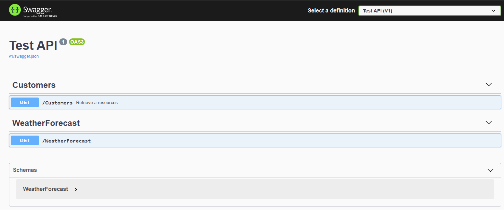
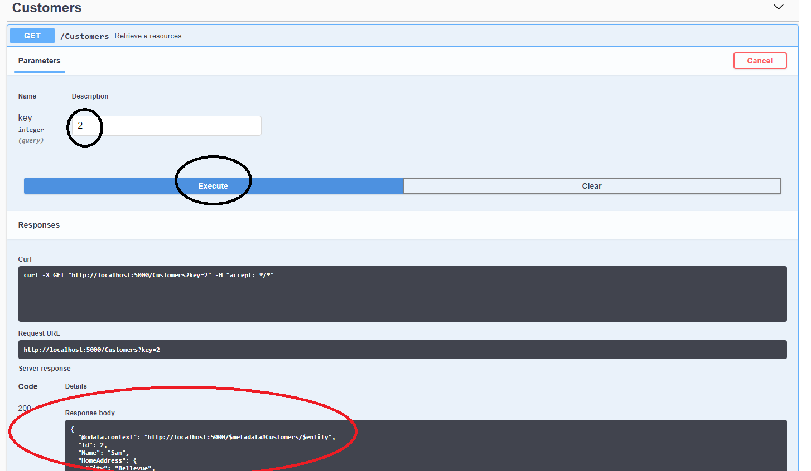

# Test the Swagger / Open API with OData Endpoint

## Introduction

It's a very simple ASP.NET Core OData Web Application. It targets to ASP.NET Core 3.1!!

**It supports Endpoint routing introduced in ASP.NET Core.**

## OData package

It's using ASP.NET Core OData 4.0 nightly package at:

https://www.myget.org/feed/webapinetcore/package/nuget/Microsoft.AspNetCore.OData/7.4.0-Nightly202001292116

You can use feed https://www.myget.org/F/webapinetcore/api/v3/index.json at visual studio.

**Important:**

This Nightly is related to the Pull Request at: https://github.com/OData/WebApi/pull/2035

It's open for all of you to review, feedback.

I am also happy to see your any contributions to my pull request and make the endpoint routing available ASAP.

## Functionalities

I add four routes in my sample:

```C#
app.UseEndpoints(endpoints =>
{
    endpoints.MapODataRoute("nullPrefix", null, model);

    endpoints.MapODataRoute("odataPrefix", "odata", model);

    endpoints.MapODataRoute("myPrefix", "my/{data}", model);

    endpoints.MapODataRoute("msPrefix", "ms", model, new DefaultODataBatchHandler());
});
```

So, you can query likes:

* `http://localhost:5000/Customers?$select=HomeAddress`
* `http://localhost:5000/odata/Customers?$select=HomeAddress`
* `http://localhost:5000/my/2/Customers?$select=HomeAddress`
* `http://localhost:5000/ms/Customers?$select=HomeAddress`

   
All of these queries output the same result as (a little bit difference between the context Uris):
```json
{
    "@odata.context": "http://localhost:5000/ms/$metadata#Customers(HomeAddress)",
    "value": [
        {
            "HomeAddress": {
                "City": "Redmond",
                "Street": "156 AVE NE"
            }
        },
        {
            "HomeAddress": {
                "City": "Bellevue",
                "Street": "Main St NE"
            }
        },
        {
            "HomeAddress": {
                "City": "Hollewye",
                "Street": "Main St NE"
            }
        }
    ]
}
```


## Discussion

1. I name the API as `MapODataRoute`, nor `MapODataServiceRoute`, is it ok?

2. $batch request is weird in current implementation. I'd love to refactor it, but not in this Nightly.

3. There are some working arounds in this Nightly. I'd invite you to review and contribute for my PR if you are interested in.

4. Welcome any feedbacks. You can leave comments in the PR, or send me email at saxu@microsoft.com


# Updated at 2/6/2020:

Now, i added swagger api into the sample project, you can see the swagger api through:
`http://localhost:5000/swagger`

You can get a page like:



You can also play it by click the Swagger API.


